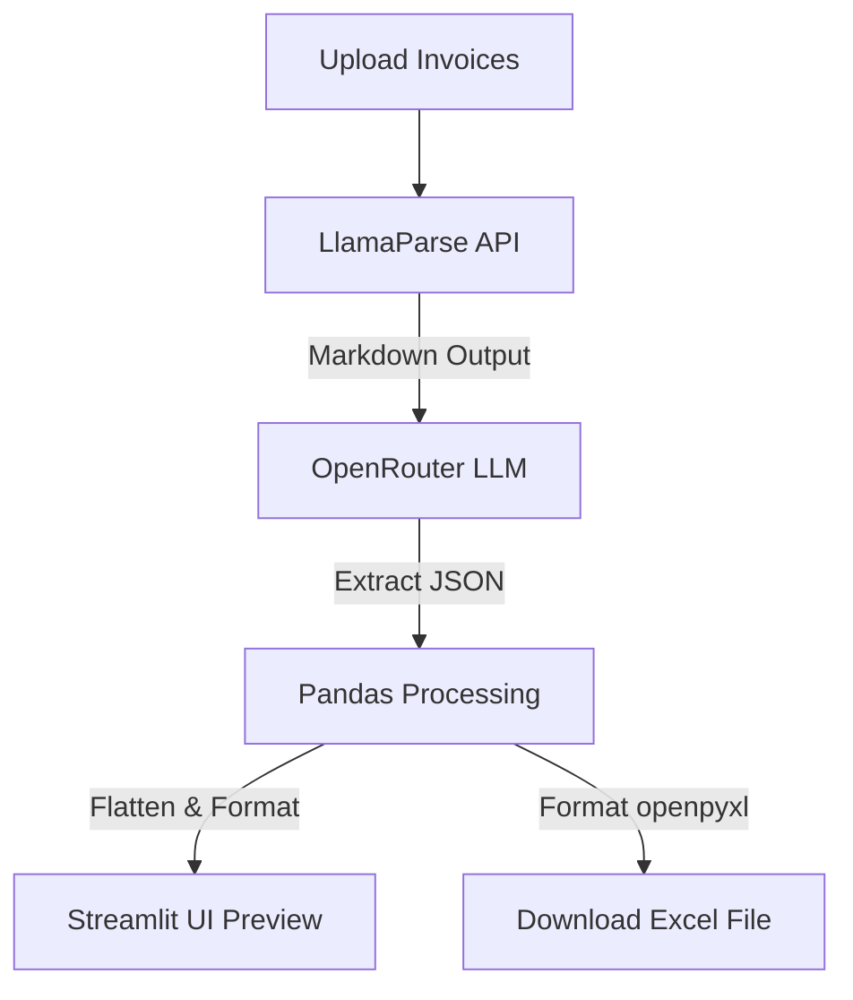

# AI Invoice Extraction Agent 📄

An intelligent agent that uses **LlamaParse** and LLMs (via OpenRouter) to extract structured details from invoice documents (PDFs, images) and export them into a professionally formatted Excel spreadsheet.

## Features

- **Advanced PDF Parsing**: Leverages **LlamaParse** to accurately extract tables, columns, and unstructured text from complex layouts.
- **AI-Driven Data Extraction**: Uses state-of-the-art LLMs (like Gemini 2.5 Flash and Llama 3.3) via OpenRouter to structure the parsed invoice content into clean JSON.
- **Line-Item Unpacking**: Automatically extracts multiple line items (Part Number & Quantity) from invoices, creating a flat tabular structure.
- **Interactive Multi-File Processing**: Process multiple invoices at once, with visual progress trackers and log messages for each file.
- **Premium User Interface**: Modern design with customized fonts, hover cards, dark-mode styling, and tabs to view extracted tables, raw parsed markdown, or processing logs.
- **Professional Excel Export**: Outputs an auto-fitted Excel file with colored headers, clean typography, proper alignment, and standard number formats.

---

## Technical Architecture



---

## Setup & Running Instructions

### 1. Requirements

Ensure you have Python 3.10+ installed.

### 2. Configuration (`.env`)

Create a `.env` file in the root directory (or edit the existing one) with your API keys:

```env
# OpenRouter API Key for structured extraction (Gemini/Llama)
OPENROUTER_API_KEY=your_openrouter_api_key_here

# LlamaCloud API Key for document parsing
LLAMA_CLOUD_API_KEY=your_llamacloud_api_key_here
```

*Note: You can also input or override these keys directly in the Streamlit Sidebar during runtime.*

### 3. Run the App

1. Activate the virtual environment:
   ```bash
   .venv\Scripts\activate
   ```
2. Run the Streamlit application:
   ```bash
   streamlit run app.py
   ```

---

## Data Schema & Output Format

The generated Excel file will contain the following columns:

| Column Name | Description | Example |
|---|---|---|
| **Invoice No** | The unique invoice identifier | `INV-2026-908` |
| **Invoice Date** | Date of invoice issue | `2026-05-25` |
| **Part No** | Part number, material code, or item identifier | `89231-X` |
| **Part Quantity** | The quantity of the specific part number | `150` |

If an invoice contains multiple line items (different parts), they will be flattened into multiple rows in the Excel file with the corresponding `Invoice No` and `Invoice Date` repeated.
